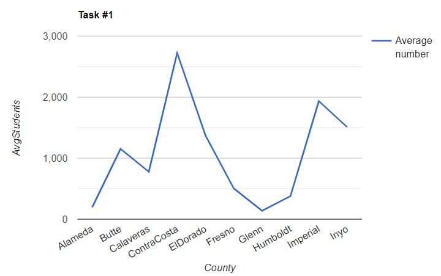

# Последовательность работы по проекту

---

1. Создание базы данных

- Использовался JDBC + SQLite (для проверки данных - DB Browser for SQLite)

Код создания:

```sql
CREATE TABLE if not exists schools
(
    id          TEXT,
    district    TEXT,
    school      TEXT,
    county      TEXT,
    grades      TEXT,
    students    REAL,
    teachers    REAL,
    calworks    REAL,
    lunch       REAL,
    computer    REAL,
    expenditure REAL,
    income      REAL,
    english     REAL,
    read        REAL,
    math        REAL
);
```

Все записи в таблице - уникальные (у всех ID - оригинальный), поэтому разбивать
на несколько таблиц не имеет смысла.

=> БД уже в 3НФ.

---

2. Добавление данных в БД

- Использовался BufferedReader для построчного чтения

Сперва читаем названия колонок, после создаем PreparedStatement
для вставки данных, после чего читаем по строчке из .csv файла,
разбиваем её на отдельные параметры, обрабатываем в классe `School`,
и возвращаем обратно в виде строки. 

Класс `School`:
```java
// Как возвращаем строку с данными
// Используется массив объектов т.к. возвращаем и строки, и вещ.числа
public Object[] getArray(){
        List<Object> resList = new ArrayList<>();
        resList.add(id);
        //..
        resList.add(read);
        resList.add(math);

        return resList.toArray();
        }
```

После чего выполняем запрос и проверяем результат, если `== 1`, 
то все ок.
```java
// executing addition of new element
                var a = ps.executeUpdate();
                System.out.println("Result of adding new element, status: " + a);
```

---

# Задание №1

Выполняем запрос, получаем ответ, выводим ответ.
```java
PreparedStatement task1 = conn.prepareStatement("""
                    select county, avg(students)
                    from schools\s
                    group by county
                    limit 10
                    """);

            ResultSet r1 = task1.executeQuery();
            System.out.println("Задание №1");

            // getting data
            while (r1.next()) {
                String county = r1.getString("county");
                double avgStudents = r1.getDouble("avg(students)");
                System.out.println(county + ": " + String.format("%.2f", avgStudents));
            }
```

В консоли: 
``` 
Задание №1
"Alameda": 195,00
"Butte": 1152,50
"Calaveras": 777,00
"Contra Costa": 2725,86
"El Dorado": 1372,90
"Fresno": 504,42
"Glenn": 137,67
"Humboldt": 379,71
"Imperial": 1936,00
"Inyo": 1510,00
```

В виде графика:


---

# Задание №2

Аналогично первому за вычетом графика.

Код: 
```java
PreparedStatement task2 = conn.prepareStatement("""
                    select county, avg(expenditure)
                            from schools
                            where county in ('"Fresno"', '"Contra Costa"', '"El Dorado"', '"Glenn"')
                            and expenditure > 10
                            group by county
                    """);

            ResultSet r2 = task2.executeQuery();
            System.out.println("Задание №2");

            // getting data
            while (r2.next()) {
                String county = r2.getString("county");
                double avgStudents = r2.getDouble("avg(expenditure)");
                System.out.println(county + ": " + String.format("%.2f", avgStudents));
            }
```

Результат в консоли: 
``` 
Задание №2
"Contra Costa": 5269,45
"El Dorado": 5309,97
"Fresno": 5396,98
"Glenn": 4363,35
```

--- 

# Задание №3

Аналогично №2.

Код: 
```java
PreparedStatement task3 = conn.prepareStatement("""
                    select school
                    from schools
                    where (students BETWEEN 5000.0 and 7500.0) or (students BETWEEN 10000.0 and 11000.0)
                    order by math desc
                    limit 1
                    """);

            ResultSet r3 = task3.executeQuery();
            System.out.println("Задание №3");

            // getting data
            while (r3.next()) {
                String sch = r3.getString("school");
                System.out.println(sch);
            }
```
Результат в консоли: 
``` 
Задание №3
"Encinitas Union Elementary"
```
